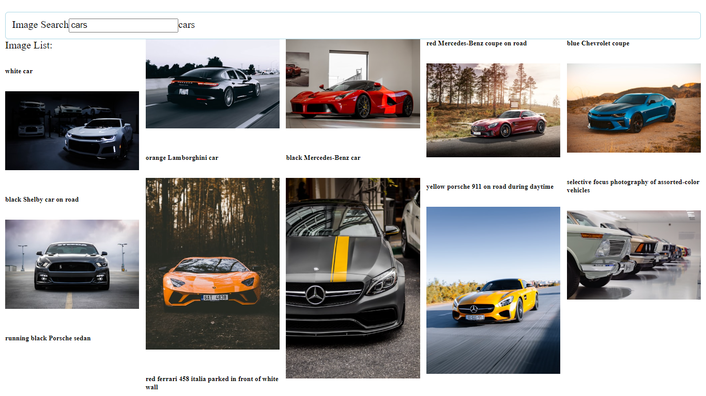

Generate unsplash.com api token and store it in *.env* file

In the project directory, you can run:

### `npm start`

Runs the app in the development mode.\
Open [http://localhost:3000](http://localhost:3000) to view it in your browser.

The search will look like:

